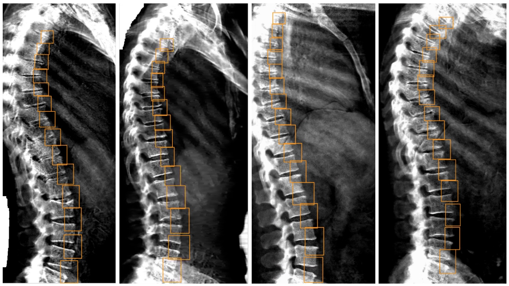
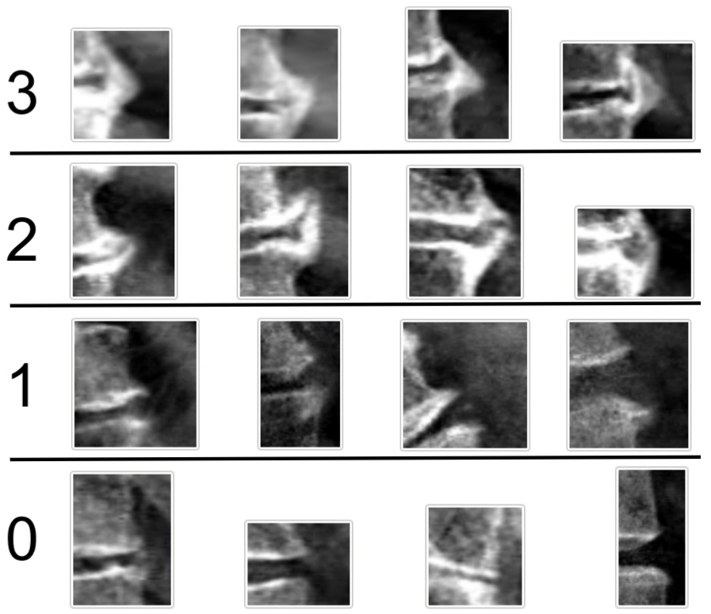
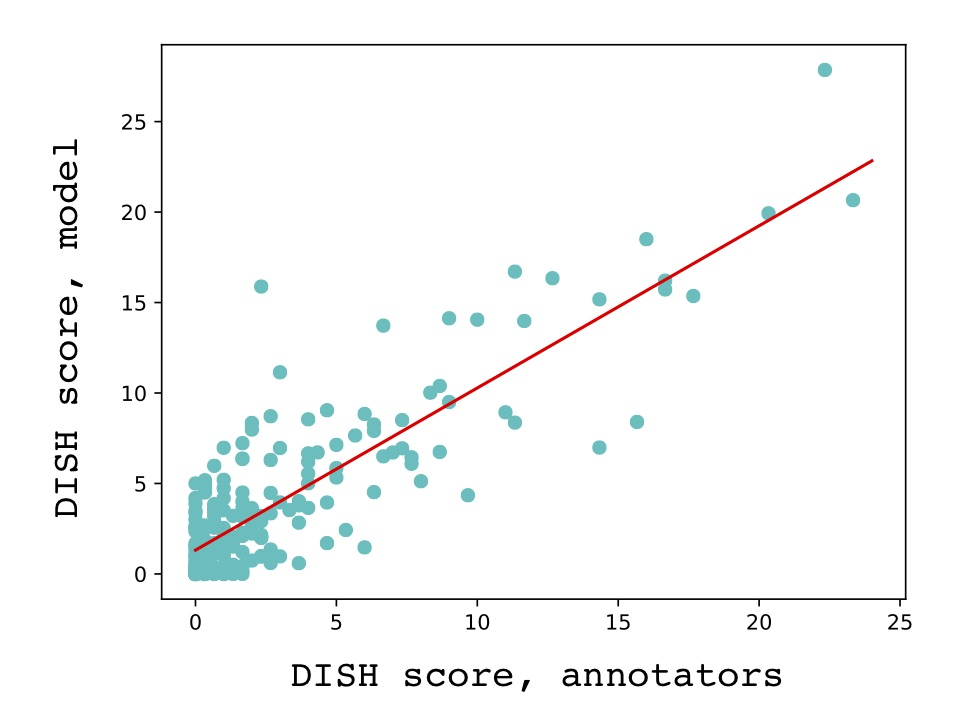
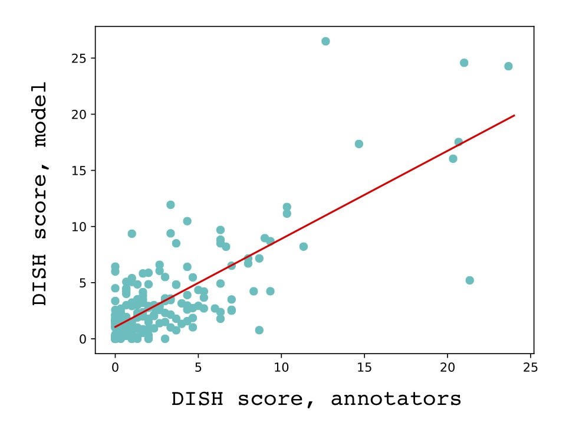

[Back to home.](../README.md)

# DISH Scoring: Methods Description

The pipeline described here scores the extent of hyperostosis that can be observed in a
lateral dual-energy X-ray absorptiometry (DEXA) scan image of a human torso.  As described
by [Kuperus et al (2018)](https://www.jrheum.org/content/jrheum/45/8/1116.full.pdf), such
hyperostosis can create bridges between vertebrae that limit flexibility and ultimately
contribute to diffuse idiopathic skeletal hyperostosis (DISH). 

The analysis occurs in three steps:
1. Identification of anterior intervertebral junctions;
2. Scoring the hyperostosis of each intervertebral junction;
3. Summing the bridge scores across the spine.

Details on each of those steps are given below, along with the final performance of the
system against hold-out test data generated by human annotators.

## Step 1: Identification of anterior intervertebral junctions.

Pathological DISH involves the linking of vertebrae by bony outgrowths that traverse
intervertebral gaps.  Its pathology results from the summed effects of hyperostosis
between all adjacent pairs of vertebrae in the spine.  The first step on analysis of
DISH was therefore the identification of the anterior portions of the intervertebral
gaps along the entire spine.  These are the loci where DISH-relevant bridges can form
that are visible in lateral DEXA images.  An object-detection model was applied to this
task. It was trained by transfer learning from the
**ssd_mobilnet_v1** model, using annotations similar to these below: 

A set of 160 images was annotated by this author, which included 2,271 boxes drawn
around vertebral junctions.  The average number of boxes per image (14.2) is used 
to define the threshold for junction annotation: for each image being evaluated,
the 14 highest-confidence annotations returned by the object detector will be used.

The annotated images were separated into training and test sets
of 100 and 60 images, respectively.  Training-set images were augmented by horizontal
flipping (all images in the study set are right-facing), inwards adjustment of image borders,
brightness, and contrast.  In addition, in order to simulate artifacts observed at low frequency
across the study set, augmentation was performed by drawing large black or white blocks randomly
along the image edges.  The final augmented training set included 1200 images and 10,244 boxes.

Performance of the object detector was evaluated in the 60-image test set using
intersection-over-union (IoU) for the 14 top-scoring predicted boxes versus all of the
annotated boxes, allowing each predicted box's intersection to only be counted for its 
most-overlapping annotated counterpart.  The average IoU across the 60 test images was
**68.9% (SD 5.9%)**.

## Step 2: Scoring the hyperostosis of each intervertebral junction.

For each intervertebral junction, a numeric score was to be assigned according to the criteria
described by [Kuperus et al (2018)](https://www.jrheum.org/content/jrheum/45/8/1116.full.pdf)
in Figure 2 of that manuscript.  Those authors provide examples and descriptions of hyperostosis
between adjacent vertebral bodies, scored on a 0-3 scale in terms of both "bridge" and "flow".
I automated that scoring, with greater attention paid to the "Bridge score" than the 
"Flow score" scale, using an image classification model.  This model classified images of individual bridges,
i.e. images extracted from the source image
using the 14 top-scoring boxes, defined by the object detection model described above.  Four 
categories were established and named numerically with reference to the bridge score 
("br0", "br1", "br2", and "br3"), corresponding to the severity 
of hyperostosis:

For the training and testing of this image classification model, the object detection model was
used to draw boxes (top-scoring 14 per image) across 893 DEXA spine images.  Each of the resulting
12,502 box images was manually classified as described above.  For the test set, 200 of the DEXA
images (comprising 2800 bridge images) were randomly selected; the remaining 693 DEXA images (9,702
bridge images) made up the pre-augmentation training set.  The categories (named "br0", "br1", "br2",
and "br3", corresponding to the bridge scores) were not evenly balanced (shown for the total annotation set):

| Class | Count | % |
| ----- | ----: | --: |
| br0 | 10270 | 82.15 |
| br1 | 1740 | 13.63 |
| br2 | 356 | 2.85 |
| br3 | 172 | 1.38 |

For the training set, the full data set was augmented first using a horizontal flip.  
In the following augmentation steps, imbalance between the classes was reduced by down-sampling
from the "br0" and "br1" classes (including in the selection of non-augmented boxes).  For each
augmentation step, a separate randomly-selected subset of the available boxes (bridge images) was sampled, ensuring
maximum diversity of images but nonetheless consistent proportions of augmentation treatments across
the classes.  The use of only 10% of "br0" boxes and 25% of "br1" boxes resulted in the following proportions:

| Class | Input % | Sampled % | Final %
| ----- | ------: | ------: | ------: |
| br0   | 82.15 | 10 | 51.8 |
| br1   | 13.63 | 25 | 21.5 |
| br2   | 2.85 | 100 | 18.0 |
| br3   | 1.38 | 100 | 8.7 |

Bridge images were extracted during the augmentation process, allowing the box itself to be randomly
modified.  The following augmentation combinations were performed: 1) non-augmented; 2) random tilt up to 30 deg.; 
3) random adjustment of the box edge positions by up to 20% of the box width or height; 4) tilt & edge; 5) tilt &
brightness; 6) edge & brightness; 7) tilt & contrast; 8) edge & contrast.  Augmentation therefore increased the 
training set size by 8-fold, resulting in the following counts for bridge images by class:

| Class | Count |
| ----- | ----: |
| br0 | 12752 |
| br1 | 5272 |
| br2 | 4496 |
| br3 | 2112 |

Training was performed using transfer learning from the **efficientnet/b1** model.  Evaluated using the
test set described above, the Cohen's kappa value for the final model was 0.405 with the following 
confusion matrix (rows=human, cols=model):

|      | br0  | br1 | br2 | br3 | total |
| ---- | ----:| ---:| ---:| ---:| -----:|
| **br0** | 2102 | 194 | 31 | 65 | 2300 |
| **br1** | 195 | 171 | 31 | 40 | 385 |
| **br2** | 8 | 19 | 29 | 26 | 75 |
| **br2** | 1 | 6 | 5 | 33 | 40 |
| **total** | 2306 | 234 | 96 | 164 | |

**Cohen's kappa (test set) = 0.405**

Due to the numeric nature of the classes, the model was also evaluated against the test set using
Pearson correlation (using the numeric values of each class "br0", "br1", "br2", and "br3"):

**Pearson correlation (test set) = 0.581**

## Step 3: Summing the bridge scores across the spine.

The final output value of the model evaluates overall DISH-like hyperostosis across the spine.  
Final evaluation
was performed using a hold-out set of 200 DEXA images that were scored by three independent raters 
(evaluation was performed using the mean rater score for each DEXA image).
Those raters used the same bridge-score scheme described above, with the appearance of DISH-related
bony outgrowth scored as either a 1, 2 or 3 (bridges without observable outgrowth implicitly received
a score of 0).  For each DEXA image, those numeric scores were summed to produce the final DISH score.

In addition to the final hold-out test used for model evaluation, the independent rater also produced
a training set of 199 images (**Rater Training**) that were used to compare alternative ML models and 
alternative strategies for interpretation of the ML model output. The classification model's test set
annotations were used ensemble across each DEXA image for the same purpose (**Preliminary Training**).  
In the case of Rater Training, performances of the
object-detection and classification models were being evaluated simultaneously. In the case of
Preliminary Training, only the performance of the classification model (and the interpretation of
its output) were being evaluated.

For each DEXA image, the top-scoring 14 boxes from the object-detection model were used to define
sub-images that were scored by the classification model, both described above.  Initially, the numbers
associated with the class assigned to each of the 14 bridge images ("br0", "br1", "br2", "br3") were summed
to produce the model-derived DISH score.  Two modifications were added to this process, described below.  

First, bridges assigned
a score of 1 ("br1") were re-evaluated and assigned a decimal score in the interval \[0-1\].  That value
was calculated as the fraction of confidence scores assigned by the model to classes "br1", "br2", and "br3".
This had the general effect of down-weighting "br1" assignments, which frequently were made spuriously (see
the confusion matrix above), unless they looked more like "br2"/"br3" instances (which provide a rare source
for mis-classification) than they looked like "br0" instances (which provide an abundant source for
mis-classification).  This modification is referred to below as the "augmentation of one" (**Aug.One**).

Second, the training of both models on horizontally-flipped images, despite the invariance of right-facing
images in the study set for which this tool was being developed, allowed the implementation of a
horizontal-flip data augmentation strategy during evaluation.  Each DEXA image was scored twice: once in
its original orientation, once in its horizontally-flipped orientation.  The output score was taken as the
average of those two scores.  This allowed the impact of both models' idiosyncrasies to be minimized.
This modification is referred to below as "**Aug.Flip**".

Pearson correlation coefficients:

| Modification | Prelim. Tr. | Rater Tr. |
| ------------ | :---------- | :-------- |
| None         | 0.832 | 0.821 |
| **Aug.One**  | 0.824 | 0.834 |
| **Aug.Flip** | 0.839 | 0.838 |
| **Aug.One + Aug.Flip** | 0.828 | **0.850** |

Use of both **Aug.One** and **Aug.Flip** was the strategy selected for the final application of
the model.  Here is a plot of performance versus the Rater Training set:

## Final performance evaluation.

The Rater Test set provided the basis for the final evaluation of the full DISH scoring tool, 
as described above, and it was considered after the model
had been applied to all study images.  Its performance is shown below:

**Pearson correlation (Rater Test set) = 0.774**

## References

Kuperus et al (2018) "The natural course of diffuse idiopathic skeletal
hyperostosis in the thoracic spine of adult males." *The Journal of Rheumatology.* 45:1116-1123. doi:10.3899/jrheum.171091
