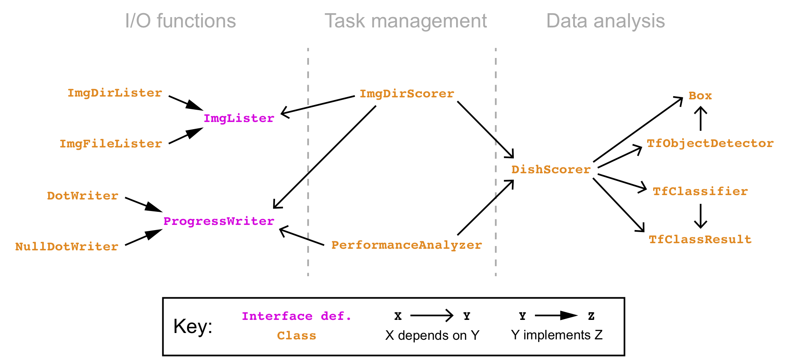

[Back to home.](../README.md)

# Developer Documentation

## Module Organization

This system is implemented using a data-centric abstraction model.  There 
is a set of classes responsible for the analysis of data,
a set of classes responsible for input & output of progress and data,
and a pair of classes responsible for managing the overall workflow.  The following
classes are implemented, with the indicated dependencies on one another:

### Data analysis:

**DishScorer** executes the scoring of DISH in given DEXA images.  It applies ML models using stored instances of **TfObjectDetector** and **TfClassifier**,
and it interprets the results of those analyses, executing all augmentation options.

**TfObjectDetector** applies a stored tensorflow object-detection model to an image, returning a series of confidence-scored **Box** instances.

**Box** records the edges off a box on an x-y plane.  Instances can also carry score values for themselves, as well as other arbitrary data ('labels').

**TfClassifier** applies a stored tensorflow image-classification model to an image, returning an instance of **TfClassResult**.

**TfClassResult** records the confidence scores assigned to each of a set of competing classes, as is output by an image-classification ML model.

### I/O Functions:

**ImgLister** defines an interface for reading from a set of images (in this case, DEXA spines) to be 
analyzed.  Two implementing classes are provided: **ImgDirLister** iterates through all image files 
in a given directory, while **ImgFileLister** iterates through a set of image files listed in a text
file (allowing the image files to be distributed across many directories).

**ProgressWriter** defines a listener interface for reporting progress of the DISH scoring tool across a data
set.  Two implementing classes are provided: **DotWriter** prints dots to the shell as progress is made, while
**NullDotWriter** does nothing (this allows results printed to stdout to be uncluttered by progress reports).

### Task management:

**ImgDirScorer** executes DISH scoring across a series of DEXA images, defined by its stored **ImgLister** instance.

**PerformanceAnalyzer** executes DISH scoring across a series of images stored in an annotation file (listing a
score for each image).  Rather than output those scores, it prints the results of a statistical analysis of the
correlative relationship between the given & determined values.

Additional documentation is found within the code itself.

## Support data files: ML models

In addition to the source code, this pipeline requires two tensorflow 
saved-model files (`.pb`) and accompanying
label files.  These represent the ML models that are described in
the [methods](analysis.md) documentation.  

In the table below, for each ML model, the model & corresponding label file
are indicated, with a brief description of the model's purpose:

| Model File               | Label File | Purpose       |
| ------------------------ | ---------- | ------------- |
| bridgeDetectorModel.pb   | bridgeDetectorLabels.pbtxt | Object detector of anterior side of gaps between adjacent vertebrae. |
| bridgeScoreModel.pb   | bridgeScoreLabels.txt | Image classification model for identifying the extent of hyperostosis for a given gap between vertebrae. |

## I/O File Formats

See input/output descriptions in the [usage instructions](getstarted.md).
